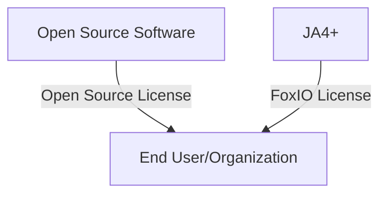

# FoxIO Licensing FAQ 

__JA4: TLS Client Fingerprinting__ is [open-source, BSD 3-Clause](https://github.com/FoxIO-LLC/ja4/blob/main/LICENSE-JA4), same as JA3. FoxIO does not have patent claims and is not planning to pursue patent coverage for JA4 TLS Client Fingerprinting. This allows any company or tool currently utilizing JA3 to immediately upgrade to JA4 without delay.

__JA4S, JA4L, JA4H, JA4X, JA4SSH, and all future additions, (collectively referred to as JA4+)__ are licensed under the [FoxIO License 1.1](https://github.com/FoxIO-LLC/ja4/blob/main/LICENSE). This license is permissive for most use cases, including for academic and internal business purposes, but is not permissive for monetization. If, for example, a company would like to use JA4+ internally to help secure their own company, that is permitted. If, for example, a vendor would like to sell JA4+ fingerprinting as part of their product offering, they would need to request an OEM license from us.

All JA4+ methods are patent pending.

This licensing allows us to provide JA4+ to the world in a way that is open and immediately usable, but also provides us with a way to fund continued support, research into new methods, and the development of the upcoming JA4 Database. We want everyone to have the ability to utilize JA4+ and are happy to work with vendors and open source projects to help make that happen.

## Open Source Combinations

If you are an end user/organization, skip to [here](https://github.com/FoxIO-LLC/ja4/blob/main/License%20FAQ.md#what-if-i-am-an-end-user).  
If you are an open source software contributor, continue below.

### Can I combine and distribute JA4+ with my open source software?

That depends on the license for your open source software. The [FoxIO License](https://github.com/FoxIO-LLC/ja4/blob/main/LICENSE) does not restrict combinations of software. 

Open source licenses come in three main flavors: 

- __Permissive__. These include BSD, MIT, Apache, and others. These licenses place no conditions on the combinations of software.
- __Weak Copyleft__. These include licenses like LGPL, Eclipse, CPL, CDDL, and Mozilla Public License. These can usually be combined with JA4+. LGPL has some special rules for linking; be sure you follow them.
- __Strong Copyleft__. These include primarily GPL and AGPL. The rules for these licenses are more complex, see below.

#### Combining JA4+ with GPL

The rules about combining GPL software and JA4+ are driven by __the requirements of GPL__, not the FoxIO license. These rules for GPL were not created by FoxIO and cannot be changed by FoxIO. The rules of GPL are chosen by the authors of the GPL software, and are intended to limit the kinds of combined software you can redistribute. See the [GPL FAQ from the Free Software Foundation](https://www.gnu.org/licenses/old-licenses/gpl-2.0-faq.html) for more details. 

The GNU General Public License, requires that if you distribute a “Work based on the Program” you must provide the work under GPL or compatible licenses. Compatible licenses would include, for example, LGPL, MIT and BSD, but they would not include any license with a restriction, like the FoxIO license.

You can [combine a GPL program](https://www.gnu.org/licenses/old-licenses/gpl-2.0-faq.html#LinkingWithGPL) and JA4+, and distribute them together, as long as they communicate "at arm’s length.” For example, communication over sockets, pipes, API, or via shell commands, is usually considered sufficient separation, but communication via linking or memory sharing is not. For example, how [Wireshark](https://www.wireshark.org/), a GPL licensed tool, is distributed with and uses Npcap, a [non-open source library](https://raw.githubusercontent.com/nmap/npcap/master/LICENSE).

If JA4+ is provided as a plugin, distributed separately without GPL code, that would be permitted by GPL as GPL has no requirements in the absence of distribution. An end user could then choose to download GPL software and JA4+ and use them together.

This is a general description and is not intended to provide you with legal advice. If you need more help understanding GPL, you should contact an open source licensing specialist. If you need an exception from GPL, that might be available from the authors of the GPL software, but FoxIO cannot provide it.

### If I combine JA4+ with my open source software, how does the licensing work?

If you combine JA4+ with open source software and redistribute it, you must retain the licensing for each portion separately. For example:

You cannot change the licensing of either component when you distribute it. You must provide the user with license notices for each component. In this respect, the FoxIO license and open source licenses work the same way.

When you are distributing source code, it is customary to make separate repositories for code under copyleft licenses like GPL and code under non-open source licenses. It is also customary to inform recipients of open source code of any potentially incompatible dependencies. However, these are best practices and not explicit requirements of the licenses.

### What if I am an end user?

Most open source licenses impose no conditions on end users of software, only on distributors. So you can download, for example, GPL software and JA4+ and use them together. For JA4+, you must follow the restriction in the FoxIO license which does not permit monetization. The rules about combining software mostly apply to distribution of GPL software, not use. (AGPL also imposes some conditions on certain kinds of use. For more information, see Section 13 of [AGPL](https://www.gnu.org/licenses/agpl-3.0.en.html).)

### What if I want to use JA4+ in my commercial product?

Please reach out to us [here](https://www.fox-io.com/) for a separate OEM license.

#

This FAQ is not legal advice, but it has been written in consultation with open source licensing expert [Heather Meeker](https://www.linkedin.com/in/heathermeeker/).
