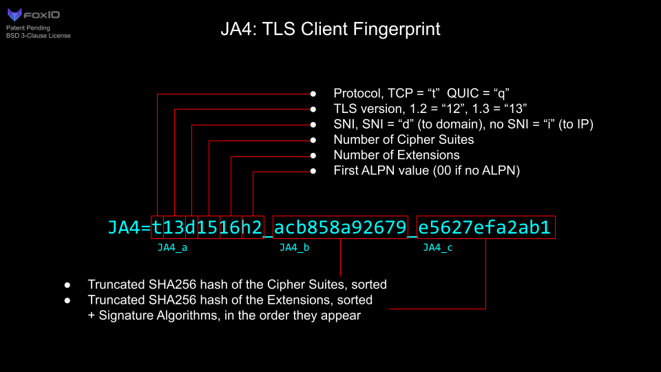
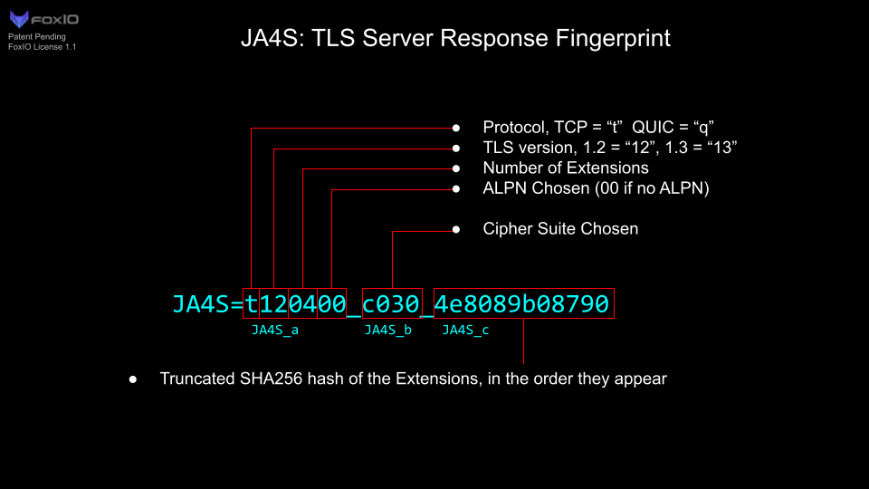
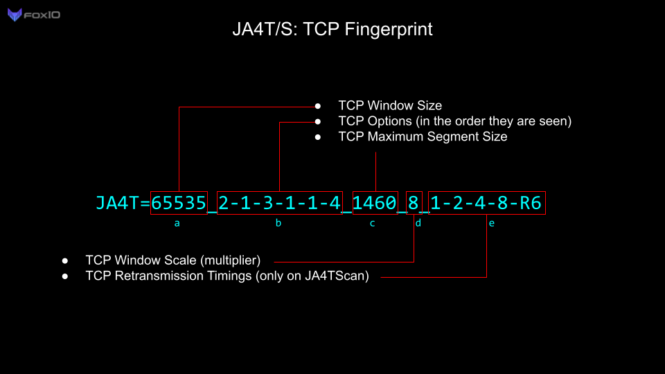
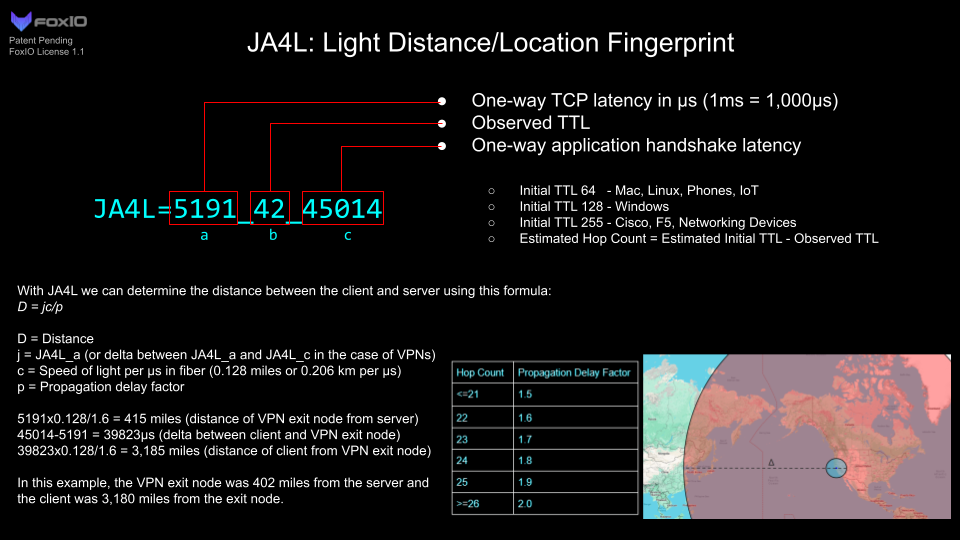

# JA4+ Technical Details  

| Full Name | Short Name | Description |
|---|---|---|
| JA4 | JA4 | [TLS Client Fingerprinting](./JA4.md) |
| JA4Server | JA4S | TLS Server Response / Session Fingerprinting |
| JA4HTTP | JA4H | [HTTP Client Fingerprinting](./JA4H.md) |
| JA4Latency | JA4L | Latency Measurement / Light Distance |
| JA4X509 | JA4X | X509 TLS Certificate Fingerprinting |
| JA4SSH | JA4SSH | SSH Traffic Fingerprinting |
| JA4TCP | JA4T | TCP Client Fingerprinting |
| JA4TCPServer | JA4TS | TCP Server Response Fingerprinting |
| JA4TCPScan | JA4TScan | Active TCP Fingerprint Scanner |

The full name or short name can be used interchangeably. Additional JA4+ methods are in the works...

Please contact john@foxio.io for in-depth implementation details.

## License

See [Licensing](../README.md#licensing) in the repo root. We are committed to work with vendors and open source projects to help implement JA4+ into those tools. Please contact john@foxio.io with any questions.

Copyright (c) 2024, FoxIO
