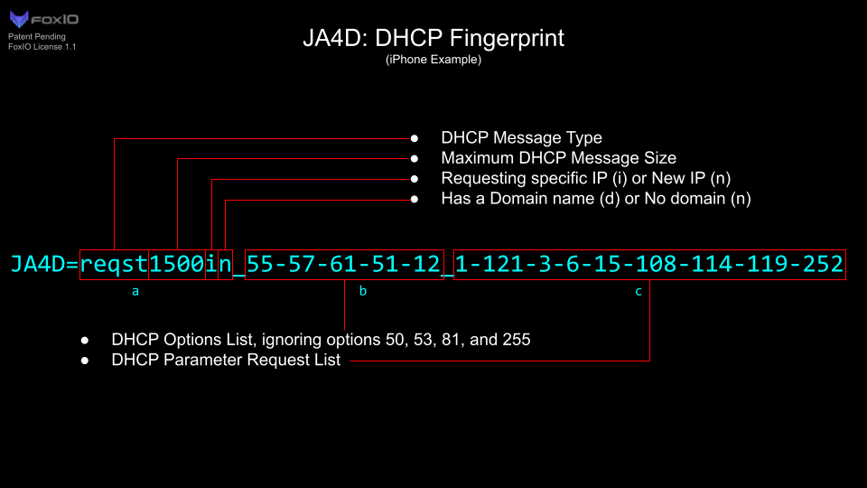
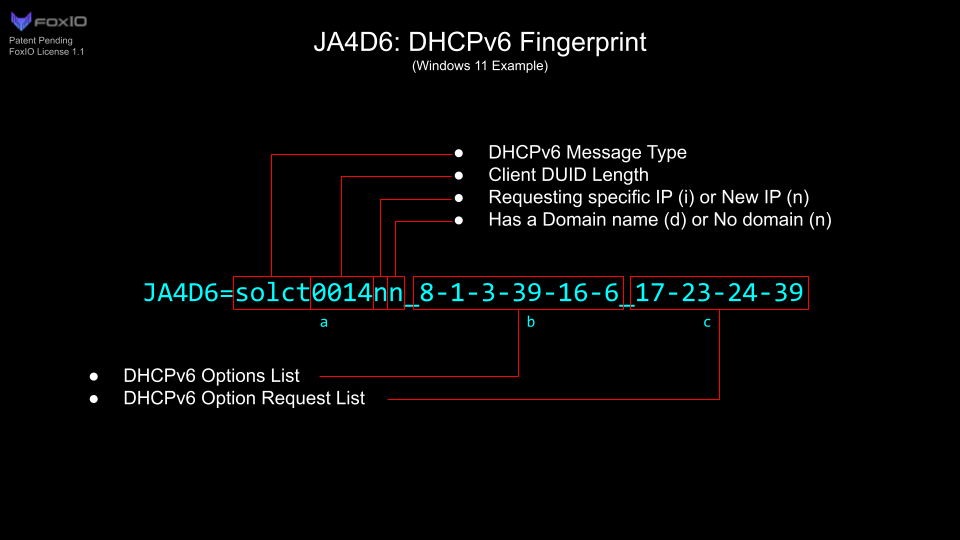

# JA4+ Technical Details  

| Full Name | Short Name | Description |
|---|---|---|
| JA4 | JA4 | TLS Client Fingerprinting |
| JA4Server | JA4S | TLS Server Response / Session Fingerprinting |
| JA4HTTP | JA4H | HTTP Client Fingerprinting |
| JA4Latency | JA4L | Client to Server Latency Measurment / Light Distance |
| JA4LatencyServer | JA4LS | Server to Client Latency Measurement / Light Distance |
| JA4X509 | JA4X | X509 TLS Certificate Fingerprinting |
| JA4SSH | JA4SSH | SSH Traffic Fingerprinting |
| JA4TCP | JA4T | TCP Client Fingerprinting |
| JA4TCPServer | JA4TS | TCP Server Response Fingerprinting |
| [JA4TCPScan](https://github.com/FoxIO-LLC/ja4tscan) | [JA4TScan](https://github.com/FoxIO-LLC/ja4tscan) | [Active TCP Fingerprint Scanner](https://github.com/FoxIO-LLC/ja4tscan) |
| JA4DHCP | JA4D | DHCP Fingerprinting |
| JA4DHCPv6 | JA4D6 | DHCPv6 Fingerprinting |

The full name or short name can be used interchangeably. Additional JA4+ methods are in the works...

Please contact john@foxio.io for in-depth implementation details and programming guides.

## License

See [Licensing](../README.md#licensing) in the repo root. We are committed to work with vendors and open source projects to help implement JA4+ into those tools. Please contact john@foxio.io with any questions.

Copyright (c) 2025, FoxIO
JA4 and JA4+ are trademarks of FoxIO, Inc.
