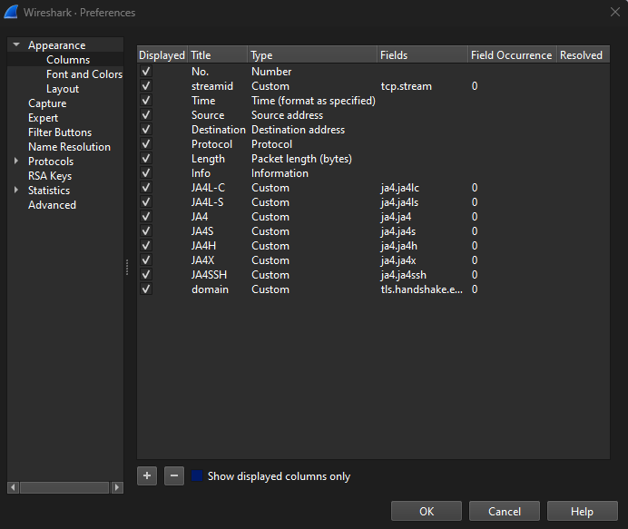

# JA4+ Plugin for Wireshark <!-- omit from toc -->

This Wireshark plugin implements JA4+, a fingerprinting methodology for network traffic analysis. It extracts JA4+ fingerprints for multiple protocols, including TLS, SSH, and TCP, directly within Wireshark, enabling efficient identification and classification of traffic. This plugin is useful for security research, threat detection, and network traffic investigation.

For more details on JA4+ and its implementations in other open-source tools (Python, Rust, and Zeek), see the [main JA4+ README](../README.md).

## Table of Contents <!-- omit from toc -->

- [Binaries](#binaries)
  - [Release Assets](#release-assets)
  - [Previous Wireshark Versions](#previous-wireshark-versions)
- [Building](#building)
- [Installing JA4+ Plugin](#installing-ja4-plugin)
  - [Installing Wireshark](#installing-wireshark)
    - [Linux](#linux)
    - [macOS](#macos)
    - [Windows](#windows)
    - [tshark](#tshark)
  - [Installing the Plugin](#installing-the-plugin)
    - [Linux](#linux-1)
    - [macOS](#macos-1)
    - [Windows](#windows-1)
- [Usage](#usage)
  - [Viewing JA4+ Fingerprints in Wireshark](#viewing-ja4-fingerprints-in-wireshark)
  - [Using `tshark` for Command-Line Analysis](#using-tshark-for-command-line-analysis)
- [Configuration](#configuration)
  - [Adding JA4+ Columns in Wireshark](#adding-ja4-columns-in-wireshark)
    - [Method 1: Using Wireshark Preferences UI](#method-1-using-wireshark-preferences-ui)
    - [Method 2: Editing the Preferences File Directly](#method-2-editing-the-preferences-file-directly)
  - [Available Preferences](#available-preferences)
    - [Usage in TShark](#usage-in-tshark)
- [Using a Key File for TLS Decryption](#using-a-key-file-for-tls-decryption)
- [Testing](#testing)
- [License](#license)

## Binaries

Download the latest JA4+ Wireshark plugin binaries from the [Releases](https://github.com/FoxIO-LLC/ja4/releases) page. The release versions for the Wireshark plugin are marked as `ja4-wireshark-plugins-YYYY.MM.DD.idx`, unlike Rust implementation releases.

### Release Assets

Plugin binaries are provided as dynamic libraries named according to the target platform. For example, `ja4.so.linux` for Linux or `ja4.dll` for Windows. Choose the appropriate file for your system.

### Previous Wireshark Versions

You can also find binaries for the previous versions of Wireshark in the [binaries](./binaries/) directory within the repository.

## Building

Navigate to the `build-scripts` directory and run the script corresponding to your system. For example, `linux_build.sh` for Linux. The script will automatically clone Wireshark and build the plugin. The resulting binary can be found in `wireshark-4.4.0/build/run/plugins/4.4/epan/`. It will be named `ja4.so` on Linux or macOS and `ja4.dll` on Windows.

## Installing JA4+ Plugin

### Installing Wireshark

The plugin has been tested with Wireshark versions 4.4.0 and 4.2.0 on macOS and Windows, and version 4.0.6 on Linux.

#### Linux

Install it using your package manager (the name of the package `wireshark` or `wireshark-qt` depends on the distribution). For example, on Ubuntu:

```sh
sudo apt install wireshark
```

#### macOS

[Download](https://www.wireshark.org/download.html) and install Wireshark.

#### Windows

[Download](https://www.wireshark.org/download.html) and install Wireshark.

#### tshark

You can use the `tshark` CLI tool as well. Refer to [Installing tshark](../README.md#installing-tshark) in the main readme for installation instructions.

### Installing the Plugin

#### Linux

1. Move and rename `ja4.so` to the global Wireshark plugins directory:  
   ```bash
   sudo mv ja4.so.linux /usr/lib/x86_64-linux-gnu/wireshark/plugins/4.4/epan/ja4.so
   ```
   or  
   ```bash
   sudo mv ja4.so.linux /usr/lib/wireshark/plugins/4.4/epan/ja4.so
   ```
   *(The exact location depends on your system's distribution and Wireshark installation.)*
2. Start Wireshark.

#### macOS

1. Move and rename `ja4.so` to the global Wireshark plugins directory:  
   ```bash
   sudo mv ja4.so.macos /Applications/Wireshark.app/Contents/PlugIns/wireshark/4-4/epan/ja4.so
   ```
2. Start Wireshark.  
3. If you receive an error, you may need to install glib via brew.
   ```bash
   brew install glib
   ```

#### Windows

1. Copy `ja4.dll` to the global Wireshark plugins directory:  
   ```txt
   C:\Program Files\Wireshark\plugins\4.4\epan\
   ```
   *(Run the command prompt as Administrator if necessary.)*
2. Start Wireshark.

## Usage

### Viewing JA4+ Fingerprints in Wireshark

Once the plugin is installed, you can view **JA4+ fingerprints** directly in Wireshark.  

1. Open Wireshark and start capturing or load a PCAP file.
2. Apply a display filter to only show packets with JA4+ fingerprints, e.g.:  
   ```
   ja4.ja4t || ja4.ja4s
   ```
3. Add JA4+ fields as **custom columns** for better visibility (see [Configuration](#configuration)).
4. Click on a packet to inspect the **JA4+ fields** in the **Packet Details pane**.

**Example Screenshot:**  
  

---

### Using `tshark` for Command-Line Analysis

Wireshark’s command-line counterpart, **tshark**, can also extract JA4+ fingerprints from a capture file:

For example, to display JA4+ fingerprints along with stream index, IP addresses, and ports, run:

```sh
tshark -r pcap/tls-sni.pcapng -Y "tls.handshake.ja4" -T fields -e tcp.stream -e ip.src -e ip.dst -e tcp.srcport -e tcp.dstport -e tls.handshake.ja4

```

**Example output:**

```txt
0       192.168.1.168   142.251.16.94   50112   443     t13d1516h2_8daaf6152771_e5627efa2ab1
        192.168.1.168   142.251.163.147                 q13d0310h3_55b375c5d22e_cd85d2d88918
        192.168.1.168   172.253.122.84                  q13d0310h3_55b375c5d22e_cd85d2d88918
1       192.168.1.168   142.251.163.147 50113   443     t13d1516h2_8daaf6152771_e5627efa2ab1
2       192.168.1.168   172.253.122.84  50114   443     t13d1516h2_8daaf6152771_e5627efa2ab1
        192.168.1.168   142.251.16.95                   q13d0310h3_55b375c5d22e_cd85d2d88918
3       192.168.1.168   142.251.16.95   50115   443     t13d1516h2_8daaf6152771_e5627efa2ab1

```

## Configuration

JA4+ fields are found under `ja4.*` in Wireshark. These fields represent different variations of the JA4+ fingerprinting method:

| **JA4+ Type** | **Field Name** |
|--------------|--------------|
| **JA4** (TLS Client Hello) | `tls.handshake.ja4` |
| **JA4S** (TLS Server Hello) | `ja4.ja4s` |
| **JA4H** (TLS Handshake) | `ja4.ja4h` |
| **JA4L** (TLS Legacy) | `ja4.ja4l` |
| **JA4LS** (TLS Legacy Server Hello) | `ja4.ja4ls` |
| **JA4X** (Extended JA4) | `ja4.ja4x` |
| **JA4SSH** (SSH Fingerprint) | `ja4.ja4ssh` |
| **JA4T** (TLS Traffic Fingerprint) | `ja4.ja4t` |
| **JA4TS** (TLS Traffic Server) | `ja4.ja4ts` |

### Adding JA4+ Columns in Wireshark

To make it easier to identify and sort JA4+ fingerprints, you can add them as **custom columns** in Wireshark.  

#### Method 1: Using Wireshark Preferences UI

1. Open **Wireshark** and go to:  
   **Edit** → **Preferences...** → **User Interface** → **Columns**  
2. Click **Add**, then specify the field name (e.g., `ja4.ja4t` for JA4T).  
3. Repeat for all JA4+ fields you want to track.  
4. Click **OK** and restart Wireshark if necessary.



#### Method 2: Editing the Preferences File Directly

Alternatively, you can manually modify Wireshark's **preferences file** using a text editor.

1. Open the preferences file in a text editor. The file is located at:
   - **Linux/macOS:** `~/.config/wireshark/preferences`
   - **Windows:** `%APPDATA%\Wireshark\preferences`
2. Locate the section labeled **"User Interface: Columns"** and add the following lines:

   ```txt
   "JA4T", "%Cus:ja4.ja4t:0:R",
   "JA4TS", "%Cus:ja4.ja4ts:0:R",
   "JA4", "%Cus:tls.handshake.ja4:0:R",
   "JA4S", "%Cus:ja4.ja4s:0:R",
   "JA4H", "%Cus:ja4.ja4h:0:R",
   "JA4L", "%Cus:ja4.ja4l:0:R",
   "JA4LS", "%Cus:ja4.ja4ls:0:R",
   "JA4X", "%Cus:ja4.ja4x:0:R",
   "JA4SSH", "%Cus:ja4.ja4ssh:0:R"
   ```

3. Save the file and restart Wireshark.

### Available Preferences

The JA4+ plugin provides a preference option that controls how certain fingerprint fields are formatted.

- `omit_ja4h_zero_sections`:  
  If enabled, the plugin omits zeroed JA4H fingerprint sections (`000000000000`) when cookie-related fields are missing.  
  This makes JA4H output more compact when cookies are not present.

#### Usage in TShark

To enable this option in `tshark`, use the `-o` flag:

```bash
tshark -o ja4.omit_ja4h_zero_sections:true -r capture.pcap -Y ja4 -T fields -e ja4.ja4h
```

## Using a Key File for TLS Decryption

Key log files can be generated by **browsers** (e.g., Firefox, Chrome) or **servers** running OpenSSL-based software. The file must be captured during traffic recording for decryption to work.

In Wireshark, go to **Edit** -> **Preferences** -> **Protocols** -> **TLS**, and change the **(Pre)-Master-Secret log filename** field.

For details on generating an SSL key log file, see:  
[Wireshark Wiki: Using the (Pre)-Master-Secret Log File](https://wiki.wireshark.org/TLS#using-the-pre-master-secret)

**Note:**

- Works for TLS 1.3 only with session keys; PFS may prevent decryption.
- You can embed the TLS key log file in a capture file: `editcap --inject-secrets tls,keys.txt in.pcap out-dsb.pcapng`

## Testing

Sample PCAP files for testing the plugin are available in the [`pcap`](../pcap/) directory. These files cover various network protocols and scenarios, including TLS, QUIC, HTTP, SSH, and edge cases. They can be used to verify expected output and assess fingerprinting accuracy.

To automate plugin testing, use the provided scripts in the [`test`](./test/) directory:

- **Output Generation:**  
  Run `generate-output-files.sh` to generate expected output files from the PCAPs using your current version of `tshark` and the JA4 plugin. This script will create `.json` files in `test/testdata/` for each PCAP in the `pcap/` directory.  
  You can also specify one or more PCAP files as command-line arguments to generate output only for those files:
  ```bash
  ./generate-output-files.sh ../../pcap/example1.pcap ../../pcap/example2.pcapng
  ```

- **Automated Testing:**  
  The `test_tshark_output.py` script (run with `pytest`) compares the actual output of `tshark` against the generated expected output files. This ensures the plugin produces consistent and correct JA4+ fingerprints.

Example usage:
```bash
cd wireshark/test
./generate-output-files.sh
pytest
```

## License

See the [Licensing](../README.md#licensing) section in the repo root. We are committed to work with vendors and open source projects to help implement JA4+ into those tools. Please contact john@foxio.io with any questions.

Copyright (c) 2024, FoxIO
